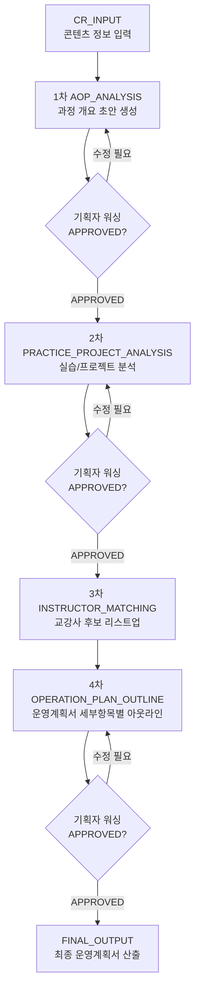

# Plan-B 1주차 진행상황: 전체 플로우 정리

## 1. 이번 주 목표

1주차 목표는 실제 자동화 구현보다, B2C 담당자가 요청한 KDC 운영계획서 자동 작성봇의 전체 흐름을 정리하는 것이다.

지난 안내 기준으로 보면 이번 주차 작업은 아래 3단계 중 첫 번째에 해당한다.

| 단계 | 내용 | 현재 상태 |
| --- | --- | --- |
| 1 | 전체적인 플로우를 만들어 놓기 | 진행 중 / 1차 정리 완료 |
| 2 | 이후 레퍼런스를 뒷단에 붙이기 | 후속 |
| 3 | PoC를 돌리면서 레퍼런스 검증하기 | 후속 |

## 2. 요청사항 재정리

B2C 담당자의 요청은 단순히 운영계획서를 한 번에 자동 생성하는 것이 아니라, CR 정보를 기반으로 단계별 초안을 만들고 담당자가 검토/수정/승인하는 시트 기반 워크플로우에 가깝다.

요청 흐름은 다음과 같다.

1. CR에 콘텐츠 정보 입력
2. 봇이 1차 AOP 분석에 과정 개요 부분 작성
3. 기획자가 내용 확인 및 워싱 후 `APPROVED`로 변경
4. 2차 실습/프로젝트 분석에서 실습 개수, 프로젝트 개수, 개요, 내용, 산출물 작성
5. 기획자가 내용 확인 및 워싱 후 `APPROVED`로 변경
6. 3차 교강사 리스트에서 교강사 DB 기반 후보 리스트업
7. 4차 운영계획서 개요에서 세부항목별 아웃라인 작성
8. 기획자가 워싱 후 `APPROVED`로 변경
9. 최종 운영계획서 형태의 산출물 생성

## 3. 1차 전체 플로우

## 4. 시트 기반 구조안

요청자의 흐름을 기준으로 보면 기능별 시트보다 단계별 시트가 더 적합하다.

| 시트명 | 역할 | 주요 입력 | 주요 출력 | 상태 |
| --- | --- | --- | --- | --- |
| `CR_INPUT` | 콘텐츠 정보 입력 | 과정명, 차시, 파트, 챕터, 클립명, 러닝타임 | 자동화 입력 데이터 | `PENDING` |
| `AOP_ANALYSIS` | 1차 AOP 분석 | CR 정보 | 과정 개요, 과정 목표, 학습 흐름 초안 | `REVIEW_PENDING` → `APPROVED` |
| `PRACTICE_PROJECT_ANALYSIS` | 2차 실습/프로젝트 분석 | 승인된 AOP + CR | 실습 개수, 프로젝트 개수, 개요, 내용, 산출물 | `REVIEW_PENDING` → `APPROVED` |
| `INSTRUCTOR_MATCHING` | 3차 교강사 리스트 | 과정 주제, 기술스택, 난이도 | 교강사 후보 리스트 | 선택/별도 플로우 가능 |
| `OPERATION_PLAN_OUTLINE` | 4차 운영계획서 개요 | 승인된 1~2차 결과 | 운영계획서 세부항목별 아웃라인 | `REVIEW_PENDING` → `APPROVED` |
| `FINAL_OUTPUT` | 최종 산출물 | 승인된 아웃라인 | 운영계획서 최종본 초안 | `DONE` |
| `RUN_LOG` | 실행 기록 | 자동화 실행 결과 | 오류/성공 로그 | `SUCCESS` / `FAILED` |

## 5. 단계별 상세 흐름

### 0단계. CR 입력

기획자 또는 BO가 CR 시트에 콘텐츠 정보를 입력한다.

필수 정보:

- 과정명
- 차시
- 파트명
- 챕터명
- 클립명
- 클립 시간
- 필수/추가 강의 여부

### 1단계. AOP 분석

봇이 CR 정보를 읽어 과정 개요 영역을 채운다.

예상 산출물:

- 과정 개요
- 과정 목표
- 주요 학습 흐름
- 차시 구성 요약
- 과정 특성

검토 방식:

- 기획자가 문체와 내용 정확성을 확인
- 수정 후 `APPROVED` 상태로 변경

### 2단계. 실습/프로젝트 분석

승인된 AOP 분석 결과와 CR을 바탕으로 실습/프로젝트 정보를 정리한다.

예상 산출물:

- 실습 개수
- 프로젝트 개수
- 실습/프로젝트 개요
- 실습/프로젝트 내용
- 예상 산출물

검토 포인트:

- CR만으로 산출물을 확정하기 어려운 경우 `검토 필요` 표시
- 프로젝트 산출물은 별도 문서로 생성하는 방안 검토

### 3단계. 교강사 리스트

교강사 DB에서 과정 주제와 맞는 후보를 리스트업한다.

현재 판단:

- 요청자도 별도 플로우 가능하다고 언급
- 1차 MVP 필수 흐름에서는 제외 가능
- 다만 전체 플로우에는 연결 지점만 남겨둔다

예상 산출물:

- 추천 교강사명
- 관련 경력
- 매칭 사유
- 검토 상태

### 4단계. 운영계획서 개요

승인된 1차, 2차 결과를 바탕으로 운영계획서 세부항목별 아웃라인을 생성한다.

예상 산출물:

- 운영계획서 목차별 아웃라인
- 항목별 작성 초안
- 참조 데이터 출처
- 검토 필요 항목

검토 방식:

- 기획자가 아웃라인과 세부항목을 워싱
- 승인 후 최종 운영계획서 생성 단계로 이동

### 5단계. 최종 운영계획서 산출

승인된 운영계획서 개요를 기반으로 최종 문서 형태의 산출물을 만든다.

후속 구현 후보:

- Google Docs 템플릿 자동 삽입
- PDF 변환
- Slack 또는 이메일 공유

## 6. 1주차 산출물

현재까지 정리한 1주차 산출물은 다음과 같다.

| 산출물 | 설명 |
| --- | --- |
| 전체 플로우 구조 | CR 입력부터 최종 운영계획서 산출까지 단계 정리 |
| 단계별 시트 구조안 | 요청자 흐름에 맞춘 시트 구성 |
| 상태값 구조 | `PENDING`, `REVIEW_PENDING`, `APPROVED`, `DONE`, `FAILED` |
| 1차 MVP 범위 가설 | 1차 AOP, 2차 실습/프로젝트, 4차 운영계획서 개요 중심 |
| 후속 범위 분리 | 교강사 DB, Docs/PDF 생성, 레퍼런스 연결, PoC |

## 7. 다음 주차 진행 방향

다음 단계는 전체 플로우 뒤에 레퍼런스를 붙이는 작업이다.

예상 작업:

1. 기존 운영계획서 완성본 2~3개 수집
2. 각 운영계획서의 세부항목을 시트 구조와 매핑
3. CR에서 자동 추출 가능한 항목과 사람이 보완해야 하는 항목 구분
4. AOP 분석, 실습/프로젝트 분석, 운영계획서 개요별 프롬프트 초안 작성
5. 샘플 CR로 PoC 실행

## 8. 담당자에게 확인할 질문

1. 1차 MVP에서 반드시 포함해야 하는 단계는 어디까지인가?
   - AOP 분석까지만
   - 실습/프로젝트 분석까지
   - 운영계획서 개요까지

2. 교강사 리스트업은 본 플로우에 포함할지, 별도 플로우로 둘지?

3. 실습/프로젝트 산출물은 시트 안에서 관리할지, 별도 문서로 생성할지?

4. 최종 운영계획서 산출은 1차 MVP에 포함할지, PoC 이후로 넘길지?

5. 승인 기준은 항목별 승인인지, 단계별 일괄 승인인지?
