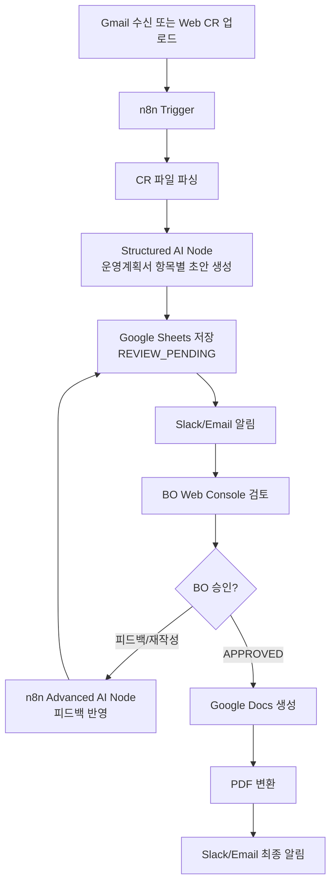
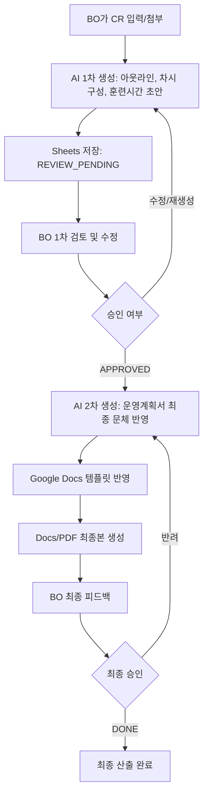

# KDC 운영계획서 자동 작성봇 PRD

## v0.3 업데이트 요약

추가 참고자료와 시스템 흐름도 검토 결과, 본 제품은 단순 웹 입력 도구가 아니라 `Gmail + n8n + AI Agent + Google Sheets + Google Docs/PDF + Slack/Email`로 연결되는 사내 자동화 워크플로우로 정의한다.

### v0.3 확정 사항

| 항목 | 결정 |
| --- | --- |
| 트리거 | Gmail 수신 또는 웹 업로드로 과정별 CR 파일을 감지한다. |
| BO 작업 화면 | BO는 웹 콘솔에서 CR 업로드, AI 결과 확인, 인라인 피드백, 항목별 승인을 수행한다. |
| 오케스트레이션 | n8n이 파일 감지, AI 호출, Sheets 저장, Docs 생성, 알림 발송을 관리한다. |
| AI 엔진 | n8n Structured AI Node / Advanced AI Node를 통해 OpenAI 또는 Claude 계열 모델을 연결한다. |
| 데이터 저장 | Google Sheets는 사용자 작업 화면이 아니라 상태값, AI 초안, BO 피드백, 실행 로그 저장소로 사용한다. |
| 알림 | Slack 또는 Email로 BO에게 검토 대기, 재생성 완료, 최종본 생성 완료를 알린다. |
| 최종 산출 | 우선 Google Docs로 생성하고 PDF 변환까지 포함한다. HWP는 후속 확장으로 둔다. |
| 검토 UX | 차시별 탭보다 운영계획서의 `해당 부분에 대한 입력값 업데이트 필요` 항목별 검토를 기본으로 한다. |

### v0.3 시스템 흐름



### v0.3 UX 원칙

- BO는 Sheets를 직접 편집하지 않는다. Sheets는 뒷단 데이터 저장소로 둔다.
- BO는 웹 콘솔에서 파일 업로드, AI 결과 확인, 인라인 피드백, 승인/재작성 요청을 수행한다.
- AI 결과는 차시별 버튼이 아니라 운영계획서 심사 항목별 row로 관리한다.
- `학습소요시간 산정사유`는 가장 먼저 품질 검증해야 하는 P0 자동화 영역으로 둔다.
- `훈련 과정 차별성`은 AI가 완성 문장만 생성하기보다 키워드와 구조를 제안하고 BO가 보완하는 형태를 기본으로 한다.
- `훈련생 모집 및 관리기준`은 우선 공통 템플릿 처리로 가정하고, 과정별 차이가 확인되면 자동화 범위에 추가한다.

## 1. 문서 목적

본 문서는 KDC 온라인 과정 운영계획서 작성 업무 중 과정별로 달라지는 서술 구간을 자동화하기 위한 제품 요구사항을 정의한다.

운영계획서는 기관 정보, 시설, 공통 운영 기준처럼 반복 사용되는 공통 구간과 과정명, 차시 구성, 학습내용, 실습/프로젝트, 학습소요시간 산정사유처럼 과정마다 달라지는 개별 작성 구간으로 나뉜다. 본 자동화의 1차 대상은 공통 구간이 아니라 CR과 훈련시간계획서에서 도출 가능한 과정별 개별 작성 구간이다.

## 2. 배경과 문제

KDC 온라인 과정마다 BO는 CR과 훈련시간계획서에 이미 존재하는 정보를 운영계획서 문체에 맞게 다시 서술하고 있다. 과정 수가 늘어날수록 작성 부담이 선형적으로 증가하며, BO의 시간은 신규 기획이나 품질 검토보다 반복 서술 작업에 많이 사용된다.

현재 업무에서 특히 반복되는 작업은 다음과 같다.

- CR의 파트, 챕터, 클립 구성을 차시별 학습내용으로 재구성
- 재생시간, 실습시간, 퀴즈, 프로젝트 시간을 종합해 학습소요시간 산정사유 작성
- 실습과제 및 프로젝트 편성 여부, 개요, 산출물 설명 작성
- 운영계획서 심사 항목별로 과정 차별성, 교수설계, 운영계획을 공적인 문체로 정리
- BO가 초안 생성 후 검토, 수정, 승인, 최종 문서 반영까지 반복 수행

## 3. 목표

CR을 입력하면 봇이 운영계획서 작성에 필요한 아웃라인과 초안을 생성하고, BO가 Sheets에서 검토 및 수정한 뒤, 승인된 내용을 기반으로 Google Docs 최종본을 생성할 수 있게 한다.

### 핵심 목표

- BO의 반복 작성 시간을 단축한다.
- AI가 초안을 생성하고 BO는 검토와 수정에 집중하는 구조를 만든다.
- 최종 운영계획서 Docs/PDF 산출까지 이어질 수 있는 데이터 구조를 만든다.
- BO가 익숙한 Sheets 환경에서 빠르게 확인하고 승인할 수 있게 한다.

### 성공 기준

| 구분 | 기준 |
| --- | --- |
| 작성 효율 | CR 기반 초안 작성 시간이 기존 대비 50% 이상 단축된다. |
| 초안 품질 | AI 초안의 70% 이상이 BO 수정 후 사용 가능한 수준이다. |
| 검토 효율 | BO가 항목별 상태와 피드백을 Sheets에서 확인하고 수정할 수 있다. |
| 산출 연계 | 승인된 데이터가 Google Docs 운영계획서 템플릿에 자동 반영될 수 있다. |
| 추적성 | AI 출력마다 원본 CR 근거와 BO 피드백 이력이 남는다. |

## 4. 사용자와 이해관계자

| 사용자 | 역할 | 주요 니즈 |
| --- | --- | --- |
| BO/운영 담당자 | 주 사용자 | CR을 기반으로 운영계획서 초안을 빠르게 만들고 검토하고 싶다. |
| 교육 PM/기획자 | 협업 사용자 | 과정 의도와 커리큘럼 흐름이 운영계획서에 정확히 반영되길 원한다. |
| AX/자동화 담당자 | 구현 사용자 | Sheets, LLM, Slack, Docs를 연결하는 안정적인 워크플로우가 필요하다. |
| 최종 검토자 | 승인 사용자 | 최종 Docs/PDF가 제출 문체와 양식에 맞는지 확인하고 싶다. |

## 5. 범위

### 5.1 자동화 대상

| 영역 | 자동화 여부 | 설명 |
| --- | --- | --- |
| 과정 개요 | 포함 | 과정 목적, 대상, 학습 흐름, 기대 성과 초안 생성 |
| 차시 구성 | 포함 | CR의 파트/챕터/클립을 차시별 학습내용으로 재구성 |
| 학습목표 | 포함 | 차시 및 과정 단위 학습목표 초안 생성 |
| 학습소요시간 산정사유 | 포함 | 재생시간, 실습, 퀴즈, 프로젝트 시간을 반영해 산정사유 작성 |
| 실습과제/프로젝트 | 포함 | 편성 여부, 개요, 수행 내용, 예상 산출물 초안 생성 |
| 훈련 과정 차별성 | 부분 포함 | CR과 BO 메모로 도출 가능한 차별성 초안 생성 |
| 교강사 및 내용전문가 운영계획 | 후순위 | 별도 입력값 또는 DB가 필요하므로 1차 범위에서는 제외 가능 |
| 훈련기관 조직도/시설/공통 정보 | 제외 | 과정별 변동 구간이 아니므로 공통 템플릿으로 관리 |
| HRD-Net 제출 | 제외 | 제출 자동화가 아니라 문서 작성 자동화에 집중 |

### 5.2 1차 MVP 범위

1차 MVP는 전체 자동화 중 1~2단계, 즉 CR 기반 초안 생성과 BO 검토 흐름을 우선 구현한다.

포함:

- CR 입력 또는 업로드
- 과정/차시별 아웃라인 생성
- 차시별 학습내용 초안 생성
- 학습소요시간 산정사유 초안 생성
- 실습/프로젝트 후보 탐지 및 초안 생성
- Sheets에 결과 저장
- BO 검토 상태값 관리
- Slack 또는 이메일 알림

후속:

- 승인된 내용을 Google Docs 운영계획서 템플릿에 삽입
- PDF 변환
- 최종 승인/반려 버튼
- 레퍼런스 운영계획서 기반 문체 보정
- 교강사 DB 연동

## 6. 전체 워크플로우



### 6.1 1단계: CR 기반 AI 초안 생성

BO가 CR을 Sheets에 입력하거나 첨부하면 봇이 CR을 읽고 운영계획서 작성에 필요한 초안을 생성한다.

산출물:

- 운영계획서 아웃라인
- 과정 개요 초안
- 차시별 학습내용
- 차시별 학습목표
- 실습/프로젝트 후보
- 학습소요시간 산정사유
- 검토 필요 항목

상태:

- 입력 전: `PENDING`
- 생성 중: `GENERATING`
- 생성 완료: `REVIEW_PENDING`
- 실패: `ERROR`

### 6.2 2단계: BO 1차 검토 및 수정

BO는 Sheets에서 AI 초안을 확인하고 직접 수정한다. 수정 완료 후 체크박스, 드롭다운, 상태값 중 하나로 승인 또는 재생성을 요청한다.

권장 UX:

- BO가 평소 사용하는 Sheets를 기본 작업 환경으로 사용한다.
- AI 생성 초안과 원본 CR 근거를 나란히 볼 수 있게 한다.
- BO 피드백란을 별도로 둔다.
- `APPROVED` 상태의 행은 자동 덮어쓰지 않는다.

### 6.3 3단계: 운영계획서 최종본 생성

승인된 Sheets 데이터를 봇에 다시 입력하면, 봇은 운영계획서 템플릿에 맞는 최종 문체와 구조로 내용을 재작성한다.

산출물:

- Google Docs 운영계획서 초안
- 필요 시 PDF 변환본
- 생성 로그

### 6.4 4단계: BO 최종 피드백

BO는 Docs/PDF 최종본을 확인하고 최종 승인하거나 반려한다. 반려 시 피드백은 다시 최종본 생성 단계에 반영된다.

상태:

- 최종 검토 대기: `FINAL_REVIEW_PENDING`
- 최종 승인: `DONE`
- 최종 반려: `FINAL_REVISION_REQUESTED`

## 7. BO 작업 환경 요구사항

### 7.1 기본 작업 환경: Google Sheets

초기 MVP에서는 BO가 익숙한 Sheets에서 입력, 수정, 승인할 수 있어야 한다.

필수 기능:

- CR 원본 입력 영역
- AI 초안 결과 영역
- BO 피드백란
- 승인 체크박스 또는 상태 드롭다운
- 재생성 요청 버튼 또는 상태값
- 실행 로그 확인

### 7.2 알림 방식

Slack 알림과 이메일 알림 중 하나를 선택할 수 있다.

Slack 알림의 장점:

- BO가 다른 업무 중이어도 확인 가능
- 승인/반려 버튼을 붙일 수 있음
- 응답이 늦어질 수 있으므로 긴급 검토에는 부적합할 수 있음

Sheets 내 알림의 장점:

- BO가 작업 중인 문맥에서 바로 확인 가능
- 셀 수정과 승인 액션이 연결됨
- 단, BO가 시트를 열어둔 상태여야 빠르게 반응 가능

권장안:

- 1차 MVP는 Sheets 상태값과 Slack 알림을 함께 사용한다.
- 액션의 기준은 Sheets 상태값으로 두고, Slack은 알림과 진입 링크 역할로 제한한다.

### 7.3 최종 산출 환경: Google Docs

최종 운영계획서는 Google Docs 템플릿에 삽입되어야 한다. BO가 여러 번 검토한 뒤 Docs로 내보내는 구조를 기본으로 한다.

## 8. 입력 데이터 요구사항

### 8.1 CR 입력 필수 필드

| 필드 | 설명 | 예시 |
| --- | --- | --- |
| `course_name` | 과정명 | AI 마케팅 콘텐츠 전략 |
| `session_no` | 차시 번호 | 1 |
| `part_name` | 파트명 | Part 1. 입문 |
| `chapter_name` | 챕터명 | Ch 1. AI 마케팅 개요 |
| `clip_name` | 클립명 | AI 마케팅 주요 사례 소개 |
| `clip_duration` | 클립 시간 | 0:12:30 |
| `lecture_type` | 필수/추가 강의 여부 | 필수강의 |

### 8.2 추가 입력 권장 필드

| 필드 | 설명 |
| --- | --- |
| `target_learning_minutes` | 차시별 목표 학습소요시간 |
| `practice_flag` | 실습과제 편성 여부 |
| `project_flag` | 프로젝트 편성 여부 |
| `quiz_flag` | 퀴즈 편성 여부 |
| `practice_topic` | 실습 주제 |
| `project_topic` | 프로젝트 주제 |
| `expected_output` | 실습/프로젝트 예상 산출물 |
| `bo_memo` | BO가 AI에 반영하고 싶은 메모 |

## 9. 자동 생성 산출물 요구사항

### 9.1 운영계획서 아웃라인

봇은 CR을 기반으로 운영계획서의 과정별 작성 항목에 들어갈 아웃라인을 생성해야 한다.

포함 항목:

- 과정 개요
- 훈련 과정 차별성
- 차시별 학습 흐름
- 실습과제/프로젝트 운영계획
- 학습소요시간 산정사유
- 검토 필요 항목

### 9.2 차시별 학습내용

차시별 파트, 챕터, 클립명을 묶어 운영계획서 문체로 학습내용을 서술한다.

품질 기준:

- CR의 차시 구조를 누락하지 않는다.
- 단순 클립 나열이 아니라 학습 흐름으로 정리한다.
- 실습, 퀴즈, 프로젝트가 있는 경우 본문에 반영한다.

### 9.3 학습소요시간 산정사유

훈련시간계획서 형식에 맞춰 총 학습 소요 시간과 구성 요소별 시간을 설명한다.

문체 예시:

```text
총 학습 소요 시간: 275분
- 강의 영상 학습 및 복습: 200분
  → 강의 영상을 학습한 후 주요 개념을 정리하고 복습하는 데 필요한 시간
- 퀴즈 응시 및 리뷰: 15분
  → 학습 내용 확인을 위한 퀴즈 응시와 해설 확인 시간
- 실습 진행: 60분
  → 실습 주제 확인 후 가이드에 따라 스스로 수행하고 수정하는 데 필요한 시간
```

규칙:

- 재생시간보다 학습소요시간이 짧아지지 않게 한다.
- 퀴즈, 실습, 프로젝트가 있는 경우 별도 항목으로 분리한다.
- 산정 근거가 불충분하면 `needs_review = TRUE`로 표시한다.

### 9.4 실습/프로젝트 초안

CR에서 실습, 프로젝트, 제작, 구현, 분석, 자동화, 배포, 설계, 제출 등의 키워드를 탐지하고 BO 검토 대상으로 분리한다.

산출물:

- 실습과제 편성 여부
- 프로젝트 편성 여부
- 실습/프로젝트 개요
- 수행 내용
- 예상 산출물
- 원본 근거 클립
- 검토 필요 여부

## 10. Sheets 구조 요구사항

| 시트명 | 목적 |
| --- | --- |
| `COURSE_INDEX` | 과정 단위 상태 관리 |
| `CR_INPUT` | 원본 CR 입력 |
| `AOP_DRAFT` | 과정 개요, 차시별 학습내용, 학습목표 초안 |
| `TIME_REASON_DRAFT` | 훈련시간 및 학습소요시간 산정사유 초안 |
| `PRACTICE_PROJECT_REVIEW` | 실습/프로젝트 후보 및 BO 판단 |
| `FINAL_DOC_EXPORT` | Docs 생성 대상 데이터 및 내보내기 상태 |
| `RUN_LOG` | 자동화 실행 로그 |

## 11. 상태값 정의

| 상태값 | 의미 | 처리 주체 |
| --- | --- | --- |
| `PENDING` | 입력 완료, AI 생성 대기 | BO |
| `GENERATING` | AI 생성 중 | 자동화 |
| `REVIEW_PENDING` | BO 검토 대기 | BO |
| `REGENERATE_REQUESTED` | BO가 재생성 요청 | BO/자동화 |
| `APPROVED` | BO 1차 승인 완료 | BO |
| `FINAL_GENERATING` | Docs 최종본 생성 중 | 자동화 |
| `FINAL_REVIEW_PENDING` | 최종본 검토 대기 | BO |
| `FINAL_REVISION_REQUESTED` | 최종본 수정 요청 | BO/자동화 |
| `DONE` | 최종 승인 완료 | BO |
| `ERROR` | 오류 발생 | 자동화/관리자 |

## 12. 시스템 요구사항

### 12.1 권장 기술 스택

| 도구 | 역할 |
| --- | --- |
| Google Sheets | CR 입력, AI 초안 검토, 상태 관리 |
| Apps Script | Sheets 내 버튼, 상태 변경, 간단한 트리거 |
| n8n | 전체 워크플로우 오케스트레이션 |
| Claude API 또는 LLM API | 운영계획서 초안 및 최종 문장 생성 |
| Slack | BO 알림, 검토 링크 전달, 승인/반려 알림 |
| Google Docs | 최종 운영계획서 문서 생성 |
| Google Drive | 생성 문서 저장 및 버전 관리 |

### 12.2 Apps Script 우선 검토

배포 관점에서는 Vercel보다 Apps Script를 우선 검토한다. BO가 Sheets와 Docs를 중심으로 작업하므로, 버튼 실행, 상태값 변경, Docs 템플릿 복사, 간단한 알림은 Apps Script가 더 빠르게 적용될 수 있다.

n8n은 외부 LLM 호출, Slack 연동, 장기적으로 복잡해질 워크플로우 관리에 사용한다.

## 13. 비기능 요구사항

| 항목 | 요구사항 |
| --- | --- |
| 보안 | CR과 운영계획서 데이터는 승인된 계정과 워크스페이스에서만 접근 가능해야 한다. |
| 추적성 | AI 출력, BO 수정, 승인 상태, 재생성 이력이 남아야 한다. |
| 안정성 | `APPROVED` 행은 자동 재생성으로 덮어쓰지 않는다. |
| 오류 처리 | 필수 필드 누락, LLM 실패, JSON 파싱 실패를 RUN_LOG에 기록한다. |
| 확장성 | 과정 수가 늘어도 동일한 Sheet/Docs 템플릿 구조로 처리 가능해야 한다. |
| 사용성 | BO는 별도 웹앱 학습 없이 Sheets에서 대부분의 작업을 수행할 수 있어야 한다. |

## 14. 리스크와 대응

| 리스크 | 설명 | 대응 |
| --- | --- | --- |
| CR 데이터 품질 편차 | 과정마다 CR 작성 방식이 다를 수 있음 | 필수 필드 검증, 누락 필드 표시 |
| AI 환각 | CR에 없는 내용을 과도하게 창작할 수 있음 | 근거 행 표시, 창작 금지 프롬프트, 검토 필요 플래그 |
| 산정사유 오류 | 재생시간, 실습시간, 훈련시간 계산이 불일치할 수 있음 | 계산 로직은 Sheets/Apps Script에서 처리하고 LLM은 서술 중심으로 제한 |
| BO 검토 지연 | Slack 알림만으로는 확인이 늦어질 수 있음 | Sheets 상태 대시보드와 Slack 알림 병행 |
| Docs 템플릿 매핑 난도 | 운영계획서 양식의 세부 항목 매핑이 복잡할 수 있음 | 먼저 자동화 대상 항목을 확정하고 단계적으로 매핑 |
| 웹앱 초기 비용 | 별도 Web UX는 초기 설계/개발 부담이 큼 | 1차 MVP는 Sheets 중심, 필요 시 이후 Sidebar/Web으로 확장 |

## 15. MVP 구현 우선순위

| 우선순위 | 기능 | 이유 |
| --- | --- | --- |
| P0 | CR 입력 스키마 확정 | 자동화 품질의 기준점 |
| P0 | AI 초안 생성 프롬프트 | 실제 작성 시간 단축 효과 검증 |
| P0 | Sheets 검토/승인 상태값 | BO 검토 루프 구현 |
| P0 | 학습소요시간 산정사유 생성 | 반복 작성 부담이 큰 핵심 항목 |
| P1 | 실습/프로젝트 후보 탐지 | 운영계획서 심사 항목과 연결 |
| P1 | Slack 알림 | BO 검토 진입 개선 |
| P1 | Docs 템플릿 내보내기 | 최종 산출물 자동화 연결 |
| P2 | Slack 승인/반려 버튼 | 사용성 개선 |
| P2 | Sidebar/Web UI | Sheets만으로 부족할 때 확장 |
| P2 | 교강사 DB 연동 | 별도 데이터 구조 필요 |

## 16. 확인 질문

BO 또는 담당자에게 다음 항목을 확인해야 한다.

1. 1차 MVP에서 최종 Docs 생성까지 포함해야 하는가, 아니면 Sheets 초안 검토까지로 둘 것인가?
2. BO가 가장 힘들어하는 구간은 차시 구성, 학습소요시간 산정사유, 실습/프로젝트 설명, 전체 분량 중 무엇인가?
3. 승인 방식은 행별 승인, 시트별 승인, 과정별 일괄 승인 중 어느 방식이 편한가?
4. Slack 알림은 단순 알림이면 충분한가, 승인/반려 버튼까지 필요한가?
5. 운영계획서 템플릿에서 자동 삽입해야 하는 세부 항목의 최종 목록은 무엇인가?
6. 훈련시간계획서의 학습소요시간 계산 기준은 고정 규칙이 있는가, BO 판단이 필요한가?
7. 실습/프로젝트 산출물은 운영계획서 본문 안에 넣을지, 별도 문서로 관리할지?

## 17. 1차 개발 산출물

1차 개발이 완료되면 다음 산출물이 있어야 한다.

- CR 입력용 Google Sheets 템플릿
- AI 초안 결과 시트
- 상태값 및 BO 피드백 컬럼
- LLM 입출력 JSON 계약
- 초안 생성 프롬프트
- 실행 로그
- Slack 알림 메시지 템플릿
- 샘플 CR 기반 생성 결과
- BO 검토용 샘플 운영계획서 초안
